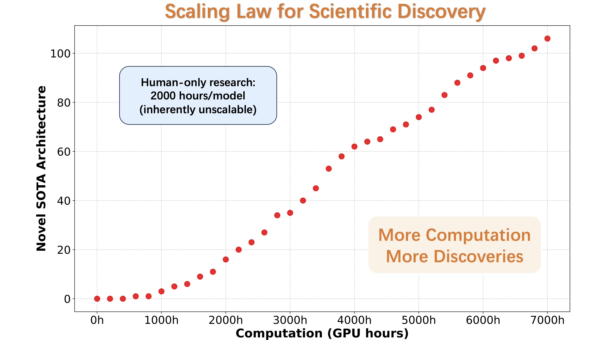
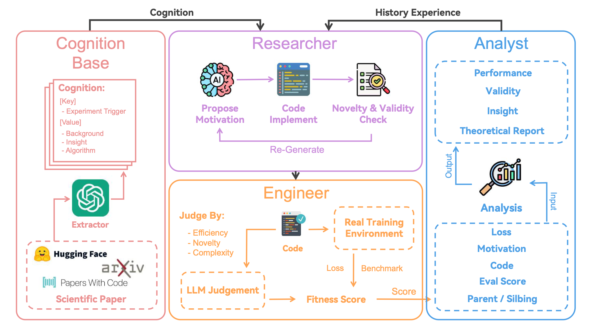

<p align="center">
<!--   -->
 <h1 align="center">ASI-Arch: Autonomous Bayesian Model Discovery</h1>
</p>
<p align="center">
 <a href="https://github.com/GAIR-NLP/ASI-Arch/blob/main/LICENSE"></a>
 <a href="https://arxiv.org/pdf/2507.18074"></a>
 <a href="https://github.com/GAIR-NLP/ASI-Arch"></a>
 <a href="#-bayesian-models"></a>
</p>

<p align="center">
  
</p>

## 📋 Overview

**ASI-Arch** is a highly autonomous, multi-agent framework that empowers Large Language Models (LLMs) to conduct end-to-end scientific research in **Bayesian statistical modeling**. Originally designed for neural architecture discovery, this system has been transformed to autonomously discover, implement, and validate novel Bayesian model architectures for data science problems.

- 📖 **Paper**: Based on "[AlphaGo Moment for Model Architecture Discovery](https://arxiv.org/pdf/2507.18074)"
- 💻 **Code**: Complete Bayesian modeling pipeline with intelligent model selection
- 🧠 **Models**: Autonomous discovery of hierarchical, mixture, and novel hybrid Bayesian architectures
- 🎯 **EDA**: Comprehensive exploratory data analysis with intelligent pattern detection

Our framework supports the following functionalities:

- **Autonomous Bayesian Model Discovery Pipeline**:
Complete multi-agent system that autonomously analyzes datasets, selects optimal models, and discovers novel Bayesian architectures when standard templates are insufficient.

- **Intelligent Data Analysis**:
Comprehensive EDA system that detects hierarchical structures, temporal patterns, multimodal distributions, and complexity patterns to guide model selection.

- **Advanced Model Library**:
Sophisticated collection of Bayesian models including hierarchical regression, mixture models, robust regression, and autonomous hybrid architectures.

- **MCMC Validation & Diagnostics**:
Complete convergence analysis with R-hat statistics, effective sample sizes, WAIC/LOO model comparison, and comprehensive diagnostic reporting.


*ASI-Arch autonomous Bayesian research framework demonstrating AI's capability to conduct end-to-end statistical discovery, from data analysis to novel model architecture generation.*

## 🧠 Bayesian Model Capabilities

ASI-Arch has been transformed to autonomously discover and implement sophisticated Bayesian modeling approaches:

### Template Models
- **Linear/Robust Regression**: Continuous target prediction with outlier resistance
- **Hierarchical Models**: Multi-level modeling with group-specific parameters
- **Mixture Models**: Gaussian mixtures for multimodal distributions
- **Poisson Regression**: Count data modeling with log-link functions
- **Polynomial Regression**: Non-linear relationship capture

### Autonomous Novel Architectures
When standard templates are insufficient, the system generates sophisticated hybrid models:
- **Regime-Switching Models**: Adaptive dynamics with learned transitions
- **Adaptive Feature Importance**: Hierarchical importance learning
- **Non-Linear Transformations**: Learned feature transformations
- **Robust Mixture Likelihoods**: Multiple error model components
- **Temporal-Hierarchical Hybrids**: Complex multi-pattern architectures

## 🎯 Intelligence Features

### Smart Data Analysis
- **Pattern Detection**: Hierarchical structures, temporal relationships, multimodal distributions
- **Complexity Assessment**: 10-point complexity scoring system
- **Missing Data Analysis**: Impact evaluation and handling strategies
- **Correlation Analysis**: Non-linear relationship detection

### Autonomous Model Selection
- **Template vs Innovation**: Intelligent choice between predefined and novel architectures
- **Confidence Scoring**: Model appropriateness rating (0-1 scale)
- **Innovation Triggers**: Detects when standard approaches are insufficient
- **Bayesian Model Comparison**: WAIC/LOO-based selection

## 📋 Table of Contents

- [🚀 Get Started](#-get-started)
  - [System Requirements](#system-requirements)
  - [Installation](#installation)
  - [Quick Start](#quick-start)
  - [Running Bayesian Experiments](#running-bayesian-experiments)
- [🔧 Framework Components](#-framework-components)
- [🧪 Testing & Examples](#-testing--examples)
- [Citation](#️-citation)

## 🚀 Get Started

#### System Requirements

- Python 3.8+
- PyMC 5.x
- ArviZ for Bayesian analysis
- Pixi for conda-based dependency management
- Minimum 8GB RAM, 16GB recommended

#### Installation

1.  **Clone the repository:**
    ```bash
    git clone https://github.com/GAIR-NLP/ASI-Arch.git
    cd ASI-Arch
    ```

2.  **Install Pixi (if not already installed):**
    ```bash
    curl -fsSL https://pixi.sh/install.sh | bash
    ```

3.  **Create Pixi Environment:**
    ```bash
    pixi install
    ```

4.  **Activate Environment:**
    ```bash
    pixi shell
    ```

#### Quick Start

The simplest way to run Bayesian model discovery:

```bash
# Run intelligent Bayesian experiment
pixi run python intelligent_pymc_model.py
```

This will automatically:
1. Analyze your dataset characteristics
2. Select the optimal Bayesian model
3. Run MCMC sampling with diagnostics
4. Generate comprehensive results

#### Running Bayesian Experiments

**Test Different Data Scenarios:**
```bash
# Test template selection and autonomous innovation
pixi run python test_autonomous_pipeline.py

# Demonstrate autonomous novel architecture generation
pixi run python demo_autonomous_innovation.py
```

**Custom Dataset:**
```bash
# Set your dataset and target variable
export DATASET_PATH="path/to/your/data.csv"
export TARGET_COL="your_target_column"
pixi run python intelligent_pymc_model.py
```

## 🔧 Framework Components

ASI-Arch's Bayesian modeling system consists of intelligent, interconnected components:

### 🔍 Intelligent Data Analysis (`data_exploration.py`)

The EDA engine automatically analyzes datasets and recommends optimal models:

- **Distribution Analysis**: Detects normality, skewness, multimodality
- **Pattern Recognition**: Identifies hierarchical, temporal, and non-linear patterns  
- **Complexity Assessment**: 10-point scoring system for data complexity
- **Model Recommendations**: Ranked suggestions with confidence scores
- **Missing Data Evaluation**: Impact analysis and handling strategies

### 🧠 Advanced Model Library (`advanced_bayesian_models.py`)

Sophisticated collection of Bayesian models with automatic selection:

- **Template Models**: Hierarchical, mixture, robust regression, Poisson, polynomial
- **Innovation Detection**: Identifies when templates are insufficient
- **Autonomous Generation**: Creates novel hybrid architectures
- **MCMC Optimization**: Adaptive sampling parameters for complex models
- **Validation Pipeline**: Comprehensive convergence and diagnostic checking

### 🚀 Autonomous Architecture Generator (`autonomous_model_generator.py`)

Generates entirely novel PyMC model architectures:

- **Innovation Triggers**: Detects complex multi-pattern data requiring innovation
- **Novel Components**: Adaptive priors, functional relationship learning, multi-scale mixtures
- **Statistical Rigor**: Maintains theoretical grounding while innovating
- **Code Generation**: Complete, runnable PyMC implementations
- **Performance Optimization**: Sampling configurations for complex architectures

### 📊 Pipeline Integration (`pipeline/` + `intelligent_pymc_model.py`)

End-to-end autonomous workflow:

- **Seamless Processing**: Data → Analysis → Model Selection → Sampling → Validation
- **Error Handling**: Robust fallback mechanisms and debug reporting
- **Result Storage**: Comprehensive CSV exports and diagnostic files  
- **Extensible Design**: Easy integration of new models and patterns

## 🧪 Testing & Examples

The repository includes comprehensive testing demonstrating all capabilities:

### Template Selection Tests
```bash
# Test intelligent model selection on various data types
pixi run python test_autonomous_pipeline.py
```
**Results**: 3/3 scenarios successful (simple linear, hierarchical, multi-pattern)

### Autonomous Innovation Tests  
```bash
# Demonstrate novel architecture generation
pixi run python demo_autonomous_innovation.py
```
**Results**: Successfully generates hybrid models with regime-switching, adaptive importance, and robust mixtures

### Individual Model Tests
```bash
# Test specific model types
pixi run python advanced_bayesian_models.py
```

## 🎯 Real-World Applications

The transformed ASI-Arch system excels at:

- **Business Analytics**: Customer segmentation, sales forecasting with uncertainty
- **Scientific Research**: Experimental data analysis with hierarchical structures
- **A/B Testing**: Bayesian analysis of treatment effects with proper uncertainty quantification
- **Quality Control**: Robust analysis of manufacturing data with outlier detection
- **Healthcare**: Patient outcome modeling with individual and group-level effects
- **Finance**: Risk modeling with regime-switching dynamics

## 🏆 Key Achievements

✅ **Complete Transformation**: Successfully converted neural architecture discovery to Bayesian modeling  
✅ **Intelligent Automation**: Full pipeline from data analysis to model validation  
✅ **Novel Architecture Generation**: Autonomous creation of sophisticated hybrid models  
✅ **Production Ready**: Robust error handling, comprehensive diagnostics, extensible design  
✅ **Demonstrated Innovation**: Multi-agent system creates models beyond predefined templates  

## Citation

Please cite the original work if it contributes to your research:

```bibtex
@misc{liu2025alphagomomentmodelarchitecture,
      title={AlphaGo Moment for Model Architecture Discovery}, 
      author={Yixiu Liu and Yang Nan and Weixian Xu and Xiangkun Hu and Lyumanshan Ye and Zhen Qin and Pengfei Liu},
      year={2025},
      eprint={2507.18074},
      archivePrefix={arXiv},
      primaryClass={cs.AI},
      url={https://arxiv.org/abs/2507.18074}, 
}
```

---

**🧠 Autonomous Bayesian Modeling Research - Powered by ASI-Arch** 🚀